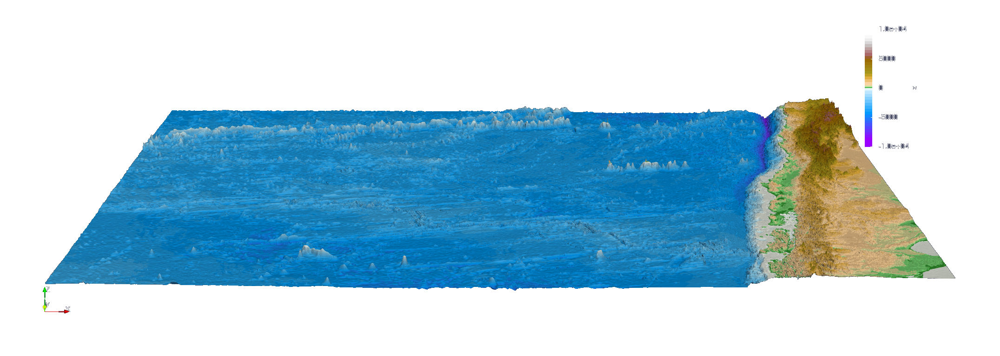

###########
Tsunami Lab
###########

This project was created as part of the Tsunami course in the winter semester 2023/24 at FSU Jena. 
The lectures content was implemented by `Luca-Philipp Grumbach <https://github.com/xLPMG>`_ and `Richard Hofmann <https://github.com/ZeyxRew>`_ as weekly homework / exam assignments.

Further information is available from: https://scalable.uni-jena.de/opt/tsunami/

The documentation can be found here: https://xlpmg.github.io/tsunami_lab/index.html

Example of a rendered solution in red(high) and blue(low) of the 2011 M 9.1 Tohoku Tsunami Event
===============================================================================================================

.. raw:: html

    <video width="100%" height="auto" controls>
      <source src="https://xlpmg.github.io/tsunami_lab/_static/assets/task_6-2-1_tohoku_1000.mp4 type="video/mp4">
    </video> 
