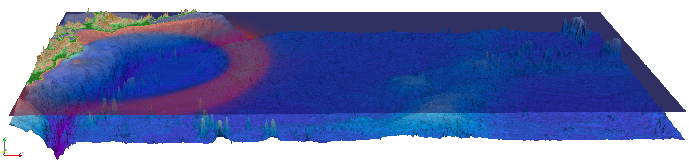

    
    Visualization of an OpenMP-parallelized tsunami simulation of the March 11, 2011 M 9.1 Tohoku event.

#############
Tsunami Lab
#############

The `tsunami lab <https://scalable.uni-jena.de/opt/tsunami/>`_ is a course taught at the `University of Jena <https://www.uni-jena.de/en/universityofjena>`_ as 
the practical lab for the lecture on parallel computing.
The goal is to write a C++ tsunami `wave equation <https://en.wikipedia.org/wiki/Wave_equation>`_ `solver <https://www.clawpack.org/riemann_book/html/Index.html>`_, optimize and parallelize it and run tsunami simulations on an `HPC cluster <https://wiki.uni-jena.de/pages/viewpage.action?pageId=22453005>`_.

During the class, we received weekly assignments which make up the final grade. Our (`Luca-Philipp Grumbach <https://github.com/xLPMG>`_ and `Richard Hofmann <https://github.com/ZeyxRew>`_)
implementations of the given weekly tasks are what make up this repository - a fully functional 2D wave equation solver for Linux and MacOS.

The documentation can be found here: https://xlpmg.github.io/tsunami_lab/index.html

