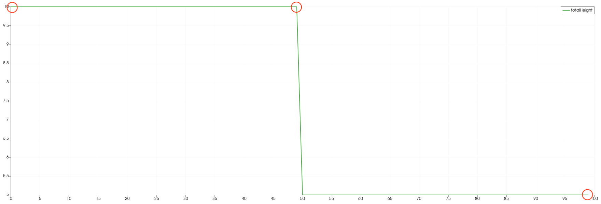
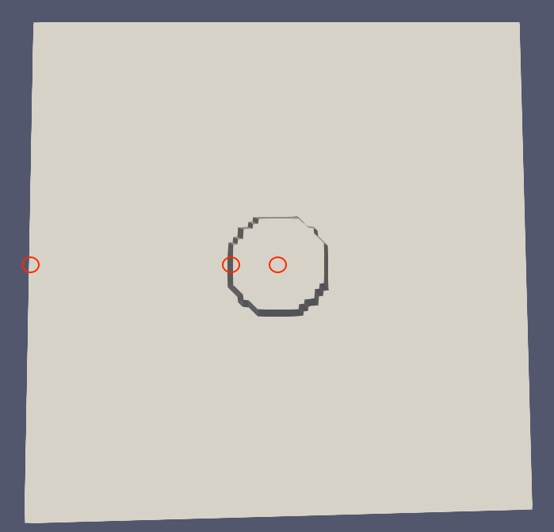
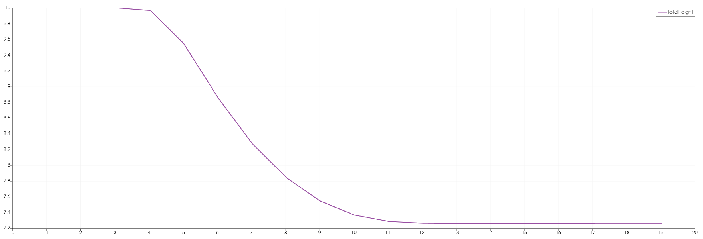
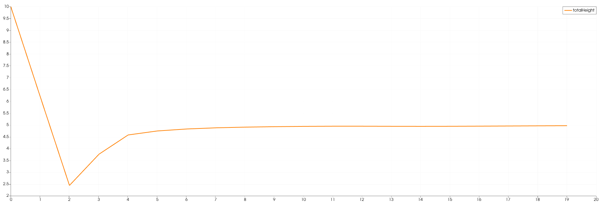
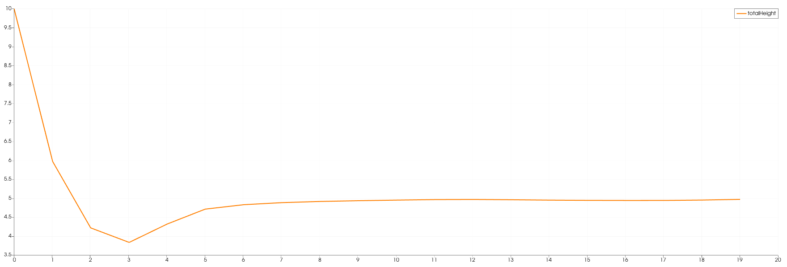
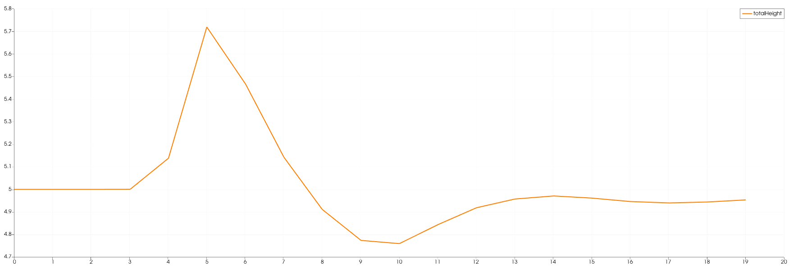

4. Two-Dimensional Solver
****************************

All project authors contributed to this assignment in equal parts.

.. warning::
    The projects :ref:`usage` has undergone major changes during this assignment. 
    We strongly advice to visit that page (again).

Task 4.1 - Dimensional Splitting
==================================

4.1.1 - 2D support
-------------------

We started by splitting ``l_dxy`` into two variables ``l_dx`` and ``l_dy``:

**(File: main.cpp)**

.. code:: cpp

  l_dx = l_simulationSizeX / l_nx;
  l_dy = l_simulationSizeY / l_ny;

And adjusted the time step accordingly:

.. code:: cpp

    // derive constant time step; changes at simulation time are ignored
    tsunami_lab::t_real l_dt = 0;
    if (l_ny == 1)
    {
        l_dt = 0.5 * l_dx / l_speedMax;
    }
    else
    {
        l_dt = 0.45 * std::min(l_dx, l_dy) / l_speedMax;
    }

    // derive scaling for a time step
    tsunami_lab::t_real l_scalingX = l_dt / l_dx;
    tsunami_lab::t_real l_scalingY = l_dt / l_dy;

This matches the given requirement

.. math::
    \Delta t < \frac{1}{2} \cdot \frac{\Delta x}{\lambda_x^\text{max}}\quad \wedge \quad \Delta t < \frac{1}{2} \cdot \frac{\Delta y}{\lambda_y^\text{max}}.

We also had to adjust the inputs for the ``Csv.cpp`` file:

.. code:: cpp

    tsunami_lab::io::Csv::write(l_dx,
                                l_dy,
                                l_nx,
                                l_ny,
                                l_waveProp->getStride(),
                                l_waveProp->getHeight(),
                                l_waveProp->getMomentumX(),
                                l_waveProp->getMomentumY(),
                                l_waveProp->getBathymetry(),
                                l_file);

To create the ``WavePropagation2d`` cpp and header files, we used the `1d`-files as a starting point.
For the header, we had to adjust most functions to make use of the ``stride`` parameter. 
We also decided on storing the momenta for the x- and y-directions in two different arrays:

**(File: WavePropagation2d.h)**

.. code:: cpp

    t_real const *getHeight()
    {
        return m_h[m_step] + 1 + getStride();
    }

    t_real const *getMomentumX()
    {
        return m_huX[m_step] + 1 + getStride();
    }

    t_real const *getMomentumY()
    {
        return m_huY[m_step] + 1 + getStride();
    }

    t_real const *getBathymetry()
    {
        return m_b + 1 + getStride();
    }

In the `.cpp` file, we duplicated the whole cell update process with different for-loops,
to execute the x- and y-sweep:

**(File: WavePropagation2d.cpp)**

.. code:: cpp

    // X-SWEEP
    for (t_idx l_ec = 1; l_ec < m_nCellsX; l_ec++)
    {
        for (t_idx l_ed = 0; l_ed < m_nCellsY + 1; l_ed++)
        {
        // determine left and right cell-id
        t_idx l_ceL = l_ec + getStride() * l_ed;
        t_idx l_ceR = l_ceL + 1;

        //cell update code from WavePropagation1d, but l_huNew and l_huOld are now l_huNewX and l_huOldX
        [...]
        }
    }

matching

.. math::
    Q_{i,j}^* = Q_{i,j}^n - \frac{\Delta t}{\Delta x} \left( A^+ \Delta Q_{i-1/2,j} + A^- \Delta Q_{i+1/2,j} \right)  \quad \forall i \in \{ 1, .., n \}, \; j \in \{ 0, .., n+1 \}

and 

.. code:: cpp

    // Y-SWEEP
    for (t_idx l_ec = 0; l_ec < m_nCellsY + 1; l_ec++)
    {
        for (t_idx l_ed = 1; l_ed < m_nCellsX; l_ed++)
        {
        // determine upper and lower cell-id
        t_idx l_ceB = l_ec * getStride() + l_ed;
        t_idx l_ceT = l_ceB + getStride();

        //cell update code from WavePropagation1d, but l_huNew and l_huOld are now l_huNewY and l_huOldY
        [...]
        }
    }

matching

.. math::
    Q_{i,j}^{n+1} = Q_{i,j}^* - \frac{\Delta t}{\Delta y} \left( B^+ \Delta Q^*_{i,j-1/2} + B^- \Delta Q^*_{i,j+1/2} \right)  \quad \forall i,j \in \{ 1, .., n \}.

Lastly, we had to adjust the ghost outflow. Instead of setting only 2 cells for a 1d row, 
we now had to set the bottom & top rows, as well as the left and right most columns.
We implemented this using for-loops.

4.1.2 - Circular Dam Break
---------------------------

Since the momenta of this setup are always 0, we won't mention them any further here.

The height however, is given by the following function:

.. code:: cpp

    tsunami_lab::t_real tsunami_lab::setups::CircularDamBreak2d::getHeight(t_real i_x,
                                                                           t_real i_y) const
    {
        i_x-=50;
        i_y-=50;
        tsunami_lab::t_real sumOfSquares = i_x * i_x + i_y * i_y;
        return std::sqrt(sumOfSquares) < 10 ? 10 : 5;
    }

We subtract 50 from both input parameters to realize the domain size of :math:`[-50, 50]^2` 
while using a simulation size of 100 and only positive numbers inside the main class.

Visualization
----------------

.. raw:: html

    <video width="100%" height="auto" controls>
      <source src="../../_static/assets/task-4.1.2-circularDamBreak.mp4" type="video/mp4">
    </video> 
    
|

4.1.3 - Bathymetry and Visualization
-------------------------------------

Once again, we went for hard-coding a simple example just for demonstration purposes:

.. code:: cpp

    l_waveProp->setBathymetry(20, 15, 30);
    l_waveProp->setBathymetry(21, 15, 30);
    l_waveProp->setBathymetry(22, 15, 30);
    l_waveProp->setBathymetry(23, 15, 30);
    l_waveProp->setBathymetry(24, 15, 30);
    l_waveProp->setBathymetry(25, 15, 30);
    l_waveProp->setBathymetry(26, 15, 30);
    l_waveProp->setBathymetry(27, 15, 30);
    l_waveProp->setBathymetry(28, 15, 30);
    l_waveProp->setBathymetry(29, 15, 30);
    l_waveProp->setBathymetry(30, 15, 30);

This creates a wall which can be seen clearly in the following animation:

.. raw:: html

    <video width="100%" height="auto" controls>
      <source src="../../_static/assets/task-4.1.3-circularDamBreakWithObstacle.mp4" type="video/mp4">
    </video> 

.. note::
    The visualisation was created with ParaView using the `TableToPoints` and `Delaunay2d` filters.

Task 4.2 - Stations
==================================

4.2.1/2 - station setup
-------------------------

Inside the config.json file we introduced an stations-array where the user can assign multiple stations. 
The mandatory variables are: station name, x-position and y-position.

e.g.

.. code:: cpp

    "stations":[
        { "name":"station_1", "locX":0, "locY":10 },
        { "name":"station_2", "locX":5, "locY":10 },
        { "name":"station_3", "locX":10, "locY":10 }
    ]

**(File: Station.cpp)**

**Constructor**

.. code:: cpp

    tsunami_lab::io::Station::Station(t_real i_x,
                                      t_real i_y,
                                      std::string i_name,
                                      tsunami_lab::patches::WavePropagation *i_waveProp)
    {
        m_x = i_x;
        m_y = i_y;
        m_name = i_name;
        m_waveProp = i_waveProp;
        m_stride = i_waveProp->getStride();
        m_data = new std::vector<std::vector<t_real>>;
    }

The constructor gets the postion and name of the station and additionally the Wavepropagation patch.
With the latter we can use the functions of Wavepropagation2d for the following functions.  
Also a vector for the data vectors is getting created.

**capture**

.. code:: cpp

    void tsunami_lab::io::Station::capture(t_real i_time)
    {
        std::vector<t_real> capturedData;
        capturedData.push_back(i_time);
        if (m_waveProp->getHeight() != nullptr)
            capturedData.push_back(m_waveProp->getHeight()[t_idx(m_x + m_y * m_stride)]);
        if (m_waveProp->getMomentumX() != nullptr)
            capturedData.push_back(m_waveProp->getMomentumX()[t_idx(m_x + m_y * m_stride)]);
        if (m_waveProp->getMomentumY() != nullptr)
            capturedData.push_back(m_waveProp->getMomentumY()[t_idx(m_x + m_y * m_stride)]);
        if (m_waveProp->getBathymetry() != nullptr)
            capturedData.push_back(m_waveProp->getBathymetry()[t_idx(m_x + m_y * m_stride)]);
        if (m_waveProp->getHeight() != nullptr && m_waveProp->getBathymetry() != nullptr)
            capturedData.push_back(m_waveProp->getHeight()[t_idx(m_x + m_y * m_stride)] +
                                m_waveProp->getBathymetry()[t_idx(m_x + m_y * m_stride)]);
        m_data->push_back(capturedData);
    }

The capture function only gets the time as input and puts the values height, Momentum X/Y and Bathymetry into a captured data vector.
In the end this vector gets pushed into the m_data vector we created in the constructor.

**write**

.. code:: cpp

    void tsunami_lab::io::Station::write()
    {
        std::string l_path = m_filepath + "/" + m_name + ".csv";
        std::ofstream l_file;
        l_file.open(l_path);
        // write the CSV header
        l_file << "time";
        if (m_waveProp->getHeight() != nullptr)
            l_file << ",height";
        if (m_waveProp->getMomentumX() != nullptr)
            l_file << ",momentum_x";
        if (m_waveProp->getMomentumY() != nullptr)
            l_file << ",momentum_y";
        if (m_waveProp->getBathymetry() != nullptr)
            l_file << ",bathymetry";
        if (m_waveProp->getHeight() != nullptr && m_waveProp->getBathymetry() != nullptr)
            l_file << ",totalHeight";
        l_file << "\n";
        // write data
        for (std::vector<t_real> elem : *m_data)
        {
            for (t_idx i = 0; i < elem.size()-1; i++)
            {
                l_file << elem[i] << ",";
            }
            l_file << elem[elem.size()-1];
            l_file << "\n";
        }
        l_file.close();
    }

The write function is getting called for every station inside the given config file.
The for-loop is getting executed as long as there are captured data vectors inside the m_data vector.

**(File: main.cpp)**

Inside the main function we introduce the l_stations vector and set it up with the folowing code:

.. code:: cpp

    if (l_configData.contains("stations"))
    {
        for (json &elem : l_configData["stations"])
        {
            tsunami_lab::t_real l_x = elem.at("locX");
            tsunami_lab::t_real l_y = elem.at("locY");
            l_stations.push_back(new tsunami_lab::io::Station(l_x,
                                                              l_y,
                                                              elem.at("name"),
                                                              l_waveProp));
            std::cout << "Added station " << elem.at("name") << " at x: " << l_x << " and y: " << l_y << std::endl;
        }
    }

.. code:: cpp

    ...
    if (l_simTime >= l_stationFrequency * l_captureCount)
    {
        for (tsunami_lab::io::Station *l_s : l_stations)
        {
            l_s->capture(l_simTime);
        }
        ++l_captureCount;
    }
        l_timeStep++;
        l_simTime += l_dt;
    }
 
The stations output frequency determines how often the capture function for each station is called.

.. code:: cpp

    for (tsunami_lab::io::Station *l_s : l_stations)
    {
        l_s->write();
    }

Now the csv files are getting written.

4.2.3 - 1d vs 2d dambreak 
-----------------------------

We positioned the stations can be seen in the following images of the initial setups:

   

.. list-table:: 
    :widths: 200 200
 
    * - |station1|
      - |station2|

   

.. |graphic3| image:: ../../_static/assets/Station2_1d.png  
   :scale: 25%
   

.. |graphic5| image:: ../../_static/assets/Station3_1d.png  
   :scale: 25%
   

The following images show the relation of height and time at one particular position. Each station collects data once every second.

.. list-table:: stations
    :widths: 200 200
    :header-rows: 1

    * - 1d
      - 2d
    * - |graphic1|
      - |graphic2|
    * - |graphic3|
      - |graphic4|
    * - |graphic5|
      - |graphic6|

**Observation**

In the 1d case the wave starts at height 10 and propagates to the right. There is a constant middle state around 7.2 meters. 
In the third image is shown that on the right side the height increases to the end.

In contrast, the height of the initial high water area decreases much faster in the 2d case. It also dips below the final height which is approximately 5 meters. 
The final height in the 2d case is lower than the one in the 1d case.
Additionally, in picture 3 is the shockwave visible.
