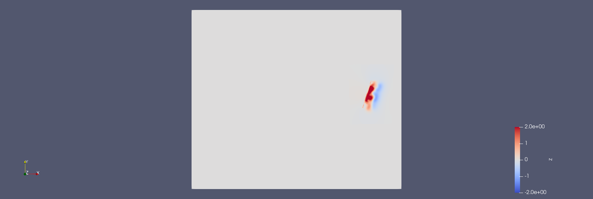
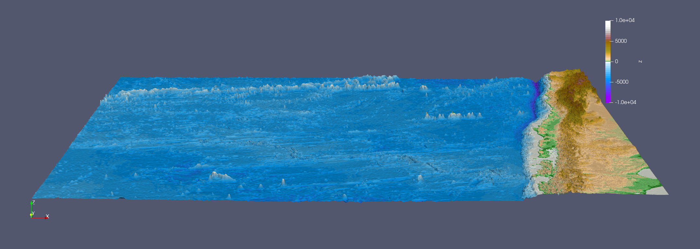
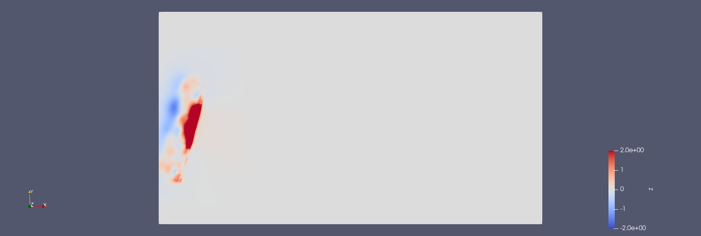

6. Tsunami Simulations
*************************************

All project authors contributed to this assignment in equal parts.

Task 6.1 - 2010 M 8.8 Chile Event
=====================================

Task 6.1.1 - Visualization of input
-------------------------------------------

scaling interval[-2,2].

scaling interval[-10000,10000].

   
Task 6.1.2 - Simulations
-------------------------------------------

`Chile 1000` 

.. raw:: html

    <video width="100%" height="auto" controls>
      <source src="../../_static/assets/task_6-1-1_chile_1000.mp4" type="video/mp4">
    </video> 

grid size: 1000

`Chile 5000` 

.. raw:: html

    <video width="100%" height="auto" controls>
      <source src="../../_static/assets/task_6-1-1_chile_5000.mp4" type="video/mp4">
    </video> 

grid size: 5000

Task 6.2 - 2011 M 9.1 Tohoku Event
=====================================

Task 6.2.1 - Visualization of input
-------------------------------------------

scaling interval[-2,2].

..  image:: ../../_static/assets/task_6-2-1_tohoku_bath.png

scaling interval[-10000,10000].

**Simulations**

`Tohoku 1000` 

.. raw:: html

    <video width="100%" height="auto" controls>
      <source src="../../_static/assets/task_6-2-1_tohoku_1000.mp4" type="video/mp4">
    </video> 

grid size: 1000
Leaves the top domain at 2900 seconds. 
Computational demant: per timestep we update 4050000 cells.

`Tohoku 5000`

.. raw:: html

    <video width="100%" height="auto" controls>
      <source src="../../_static/assets/task_6-2-1_tohoku_5000.mp4" type="video/mp4">
    </video> 

grid size: 5000
Computational demant: per timestep we update 4050000 cells.

Task 6.2.2 - Soma
-------------------------------------------

We have put the station at x=120000 and y=50000.

The initial water height is -0.7  meters.
It steadily decreases and reaches its minimum at 2620 seconds at -2.1 meters.
The water level starts rising and at 3320 surpasses 0 meters and thus the wave reaches Soma.
The wave reaches Soma after 55 minutes.
It then steadily rises and reacehs its maximum at 3870 seconds with 4.45 meters. 

`Computation`

Given is:

.. math:: \lambda \approx \sqrt{gh}

We used 15 meters as our water height from the epicenter to compute the speed.

:math:`\lambda = \sqrt{9.81*15} = 12.33 m/s`

Multiply by 3.6 to get km/h: 44.39km/h.

Using the Pythogaros we get a distance to the station 130 kilometers. 

Dividing it by the speed we get a time of 2.92 hours.