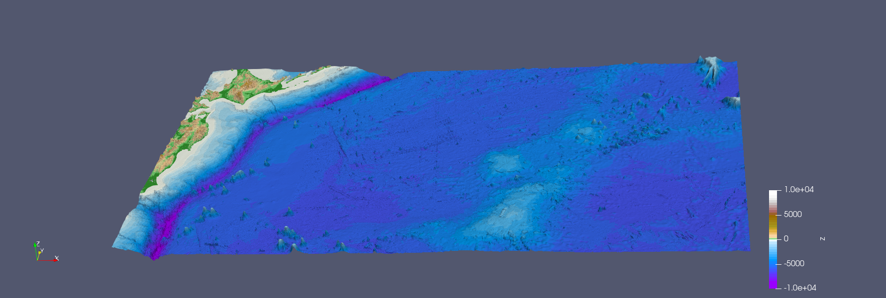

6. Tsunami Simulations
*************************************

All project authors contributed to this assignment in equal parts.

Task 6.1 - 2010 M 8.8 Chile Event
=====================================

Task 6.1.1 - Visualization off input
-------------------------------------------

We rescaled the interval to -2 and 2.

..  image:: ../../_static/assets/task_6-1-1_chile_dis.png
    

   

Task 6.2 - 2011 M 9.1 Tohoku Event
=====================================

Task 6.2.1 - Visualization off input
-------------------------------------------

We rescaled the interval to -2 and 2.

..  image:: ../../_static/assets/task_6-2-1_tohoku_dis.png

For the scaling we used the interval[-10000,10000].

