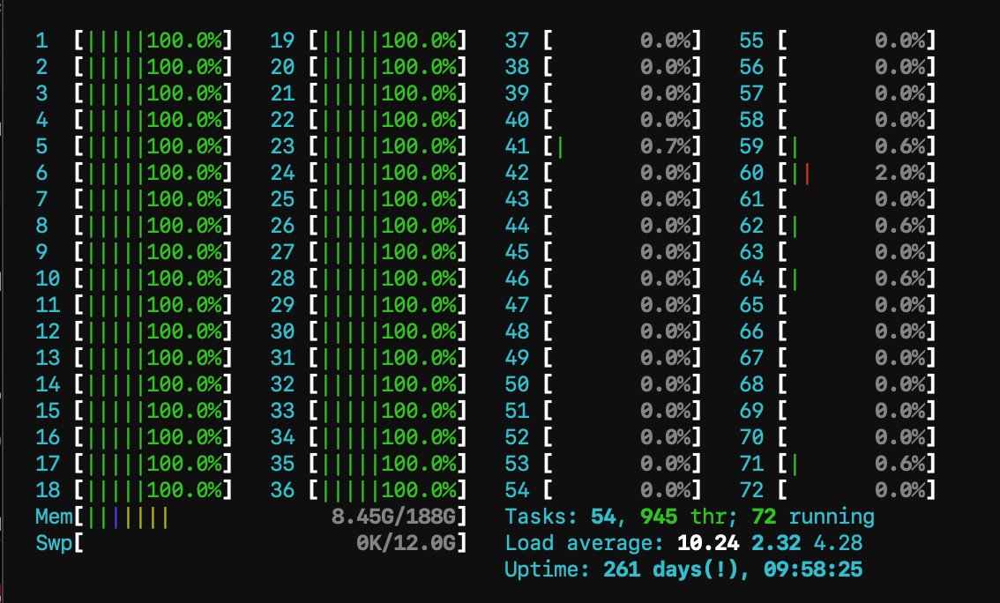
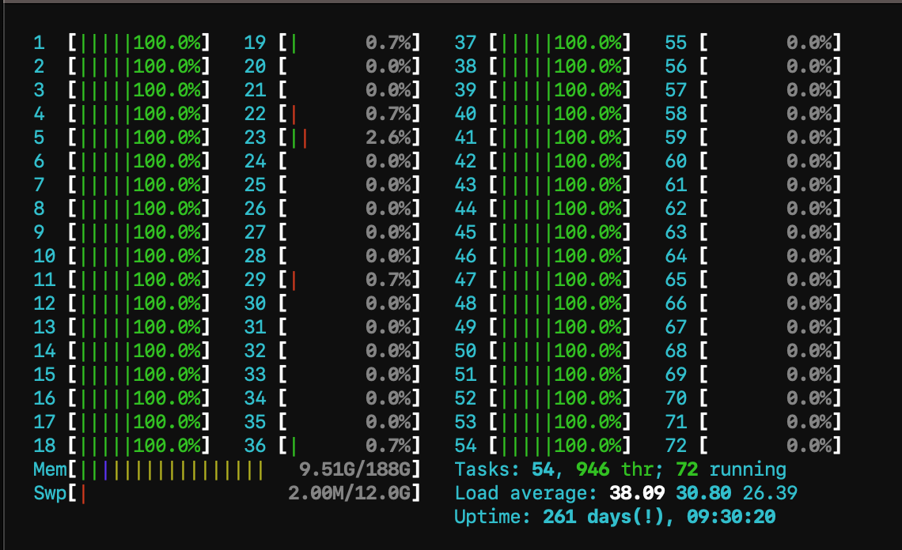

9. Parallelization
********************

9.1 OpenMP
============

9.1.1 - Parallelization with OpenMP
----------------------------------------

An easy way to parallelize our for loops is using 

.. code:: cpp

    #pragma omp parallel for

example:

.. code:: cpp

    #pragma omp parallel for
    for (unsigned short l_st = 0; l_st < 2; l_st++){
    ...

9.1.2 - Parallelization speedup
------------------------------------------

We have used following batch script for ara:

.. code:: batch

    #!/bin/bash
    #SBATCH --job-name=tohoku_1000
    #SBATCH --output=tohoku_1000.out
    #SBATCH --error=tohoku_1000.err
    #SBATCH --partition=s_hadoop
    #SBATCH --nodes=1
    #SBATCH --ntasks=1
    #SBATCH --time=10:00:00
    #SBATCH --cpus-per-task=72

    ./build/tsunami_lab configs/tohoku1000.json

And got following results:

**Without parallelization**

.. code:: text

    Note: max 10520 steps will be computed.
    entering time loop
    finished time loop

    Calculation time: 1.94101e+06ms
    = 1941.01 seconds
    = 32.3501 minutes

**With parallelization on 72 cores with 72 threads**

.. code:: text

    Note: max 10520 steps will be computed.
    entering time loop
    finished time loop

    Calculation time: 75507.5ms
    = 75.5075 seconds
    = 1.25846 minutes

.. note::

    We compiled in benchmark mode (no IO).

Speedup: :math:`\frac{1941}{75.5} = 25.7`

**With parallelization on 72 cores with 144 threads**

.. code:: text

    Note: max 10520 steps will be computed.
    entering time loop
    finished time loop

    Calculation time: 215822ms
    = 215.822 seconds
    = 3.59704 minutes

Speedup: :math:`\frac{1941}{215} = 8.99`

We can see that having twice the amount of threads resulted in a much slower computation.
We conclude that using more threads than cores results in a slowed down performance.

9.1.3 - 2D for loop parallelization
------------------------------------------

The results from above used parallelization in the outer loop.
The parallelized inner loops leads to following time:

.. code:: text

    Calculation time: 791389ms
    = 791.389 seconds
    = 13.1898 minutes

It is clear, that parallelizing the outer loop is more effficient.

9.1.4 - Pinning and Scheduling
------------------------------------------

**Scheduling**

The upper implementation used the basic :code:`scheduling(static)`.

For :code:`scheduling(dynamic)` we get:

.. code:: text
        
        Calculation time: 1.57024e+06ms
            = 1570.24 seconds
            = 26.1706 minutes

For :code:`scheduling(guided)` we get:

.. code:: text

        Calculation time: 95218ms
            = 95.218 seconds
            = 1.58697 minutes

For :code:`scheduling(auto)` we get: 

.. code:: text

        Calculation time: 84546.7ms
            = 84.5467 seconds
            = 1.40911 minutes

**Pinning** 

Using :code:`OMP_PLACES={0}:36:1` we get:

.. code:: text
            
        Calculation time: 1.39672e+06ms
            = 1396.72 seconds
            = 23.2786 minutes

Using :code:`OMP_PLACES={0,36}:18:1` we get:

.. code:: text

        Calculation time: 1.43714e+06ms
        = 1437.14 seconds
        = 23.9523 minutes

It shows that using the first strategy is more efficient for computation.