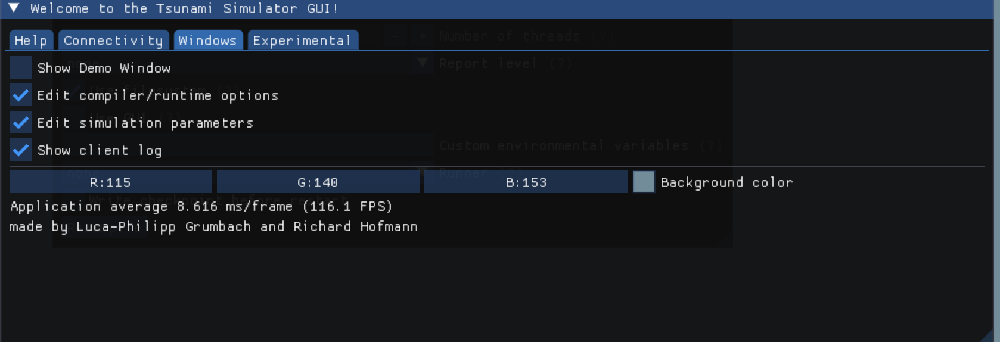
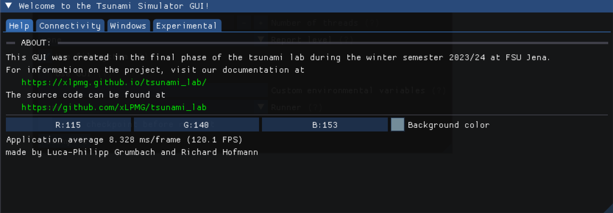

10. Project Phase
********************

In the project phase we decided to implement a userfriendly Gui. The aim is to make the usage of our Tsunami solver
as easy and interactive as possible. 

GUI 
===========

..  image:: ../../_static/assets/task-10-Gui_help.png

For the layout we chose to use multiple tabs, in order to make the use more clear.
The first page gives general informations about the project and refers to our website.

..  image:: ../../_static/assets/task-10-Gui_connectivity.png

Tab number two handles the the connection to thhe server. The properties for interacting with the server are getting set here. 
Furthermore, the connection can also be disconnected here.

On the next page the user can find all options of configuration for the simulation. The simulation parameters like cell amount, size and offset can be set here.
In Addition to that, compiler and run time options can be found here. These contain differetn modes, compiler options, flags and usage choices. 
After selecting the simulation has to be recompiled with the according button below.

The last tab contains further actions to interact with the simulation. First, the simulation can be started or killed here.
Also files for the bathymetry and displacement can be chosen. As an addition, the user can get data like the heigth from the simulation. 

Communicator
=============================

For communication between simulation and the gui Luca introduced a communication library. It sets the base for our communication via a server.

**communicator_api**

Because of our communication with messages, basic structures are introduced:

.. code:: cpp

    enum MessagePart
    {
        TYPE,
        KEY,
        ARGS
    };

    enum MessageType
    {
        SERVER_CALL,
        FUNCTION_CALL,
        OTHER,
        SERVER_RESPONSE
    };

    struct Message
    {
        MessageType type = MessageType::OTHER;
        std::string key = "NONE";
        json args = "";
    };

It also implements various functions to convert from and to json format.
An example message can be seen here:

.. code:: cpp

    //! Tells the server to restart.
    inline const Message START_SIMULATION = {MessageType::SERVER_CALL, "start_simulation"};

**Communicator.cpp**
TODO

Server
============
TODO