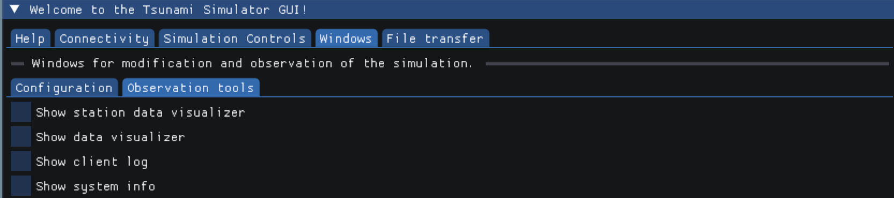

###################
10. Project Phase
###################

In the project phase we decided to implement a user-friendly Gui. The aim was to make the usage of our Tsunami solver
as easy and interactive as possible. 

*********************
Preface
*********************

While we tried to stick to our plan as best as we could, we decided to do some things a little different.
The biggest difference being a Client-Server approach although we explicitly mentioned we would not realize this.
The original triggering point for this were all kinds of loading times and issues with concurrency: 
for any GUI application, one of the key features is its responsiveness to user input. Be it numerical input or just clicking and moving things around - the GUI should react as fast as possible.
Integrating a GUI directly into the solver application while maintaining this responsiveness meant that the GUI and every other task the actual solver does, need to be separated in different threads 
to assure that the GUI thread has always time for the user.

We started off with this directly integrated and threaded approach and quickly realized that handling correct communication between two or more asynchronous running threads was getting closer and closer to just having two separate applications communicating over an API.
Knowing that this approach meant we would have to invest a lot more effort and work overtime, we decided on taking this path nontheless as it would come with a lot of other benefits as well.
Thanks to the Client-Server model we now have a GUI that can simply send commands to the server without being interrupted by long operations and without needing to wait for a response. (Most of the time at least, unless you're specifically asking for data such as water/bathymetry data.)

It can also be used in scenarios in which there is no graphical output available such as when computing on a HPC cluster. 
Just start the program as a server on the remote machine and control it visually from anywhere via laptop - its that easy. You may as well start multiple servers on different machines and control them all from one GUI. 

Lastly we would like to mention that this separation even enables you to create your own GUI application in any programming language you like. 
All it takes is to send the correct commands to the server by sticking to the API and you're good to go.

*********************
GUI (Client-side)
*********************

The Gui is desigend to be as instinctively usable as possible. Therefore, we divided the functionality of the GUI into 5 sections, which are represented by the main tabs.

..  image:: ../../_static/assets/task-10-Gui_help.png

The first tab gives some basic information about the project. It furthermore presents a link to the documentation for more details.

..  image:: ../../_static/assets/task-10-Gui_connectivity.png

On this page the user connects the client side GUI with the server. Necessary inputs for the connection are the IP address and the port. 
The connection can then be opened ore later closed.
Furthermore, the buffersize for data transfer between server and client can be modified there.

..  image:: ../../_static/assets/task-10-Gui_simulation_controlls.png

The features of this tab focus on the progress of the wave simulation. Firstly, it can be started here and be canceled anytime via "kill simulation".
In addition to that, the simulation can be stoped and continued in order to modify parameters or compile options, without further computation.
The last items on this page reset or delete files and data of the former run.

..  image:: ../../_static/assets/task-10-Gui_windows_conf.png

The next tab is divided into two section. The first concludes all options to modify the simulation parameters and the undelying project via compiler options.

..  image:: ../../_static/assets/task-10-Gui_file_transfer.png

*********************
Server-side
*********************

The first thing we did was to modularize our main ``tsunami_lab`` program. 

The original ``main.cpp`` had one main function that executed the whole program loop.
The code was moved to ``Simulator.cpp`` and we now have separate functions for the different parts of the program, such as ``prepareForCalculation()`` and ``runCalculation()``. 
``prepareForCalculation()`` itself also calls different functions, such as ``setupFolders()``, ``loadConfiguration()``, ``constructSetup()`` and so on.
We did this to have finer control, as we can now execute single parts of the program without having to run the whole simulation.

The next step was to implement a server that can be controlled via a GUI. The code for this can be found in ``Server.cpp``.
If the program is started with the ``server`` flag, it will start a server on the local machine and wait for connections. 
Once a connection is established, the server will wait for commands from the client and execute them.
To not iterate through all message keys to find the right one, a message contains extra information such as urgency and response expectation.

The actual simulation is started by sending a ``START_SIMULATION`` message to the server. 
We then use an ``std::thread`` to run the simulation in a separate thread, so the server can still receive commands while the simulation is running.
Note that only one simulation thread can be running at a time, but the GUI also provides an option to kill the current thread.

*********************
Compiling
*********************

SConstruct
======================

As a base four our GUI, we decided to use OpenGL, as it is one of or maybe even the most widely compatible and commonly known graphics standard.
We chose the `GLFW <https://www.glfw.org/>`_ implementation as it is cross-platform and also very well known.

Currently we support building the sources on Linux, MacOS and Windows and therefore had to implement different include processes for each platform:

.. code-block:: python

    if 'yes' in env['gui']:
      if OS == "Linux":
        if not conf.CheckLib('glfw'):
          print ('Did not find the glfw library!')
          exit(1)
        elif not conf.CheckLib('GL'):
          print ('Did not find the GL library!')
          exit(1)

      elif OS == "Darwin":  
        if not conf.CheckLib('glfw'):
          print ('Did not find the glfw library!')
          exit(1)

      elif OS == "Windows":
        if not conf.CheckLib('glfw3'):
          print ('Did not find the glfw3 library!')
          exit(1)
        elif not conf.CheckLib('gdi32'):
          print ('Did not find the gdi32 library!')
          exit(1)
        elif not conf.CheckLib('opengl32'):
          print ('Did not find the opengl32 library!')
          exit(1)
        elif not conf.CheckLib('imm32'):
          print ('Did not find the imm32 library!')
          exit(1)

We also added the ImGui and ImPlot sources to the build path.

If ``gui=no`` is set in the compile command, the GUI will not be built (therefore all GUI libraries ignored) and the program can be run normally using ``./tsunami_lab``.

Known error when building documentary
======================================

When building the documentary, the following error may occur:

.. code-block:: bash

    home/lpmg/tsunami_lab/docs/source/files/namespaces/lib.rst:6: WARNING: Error when parsing function declaration.
    If the function has no return type:
    Error in declarator or parameters-and-qualifiers
    Invalid C++ declaration: Expected identifier in nested name. [error at 50]
    NLOHMANN_JSON_SERIALIZE_ENUM (MessageExpectation, {{NO_RESPONSE, "no_response"}, {EXPECT_RESPONSE, "expect_response"}})
    --------------------------------------------------^

    [...]

This is because the C++ parser does know now about this macro and therefore identifies it as wrong syntax.
However the code is correct `(view the documentation here) <https://json.nlohmann.me/api/macros/nlohmann_json_serialize_enum/>`_
and we have not found away to supress this message. The error does not seem to be on our side, which is why there will be no fix for this.
The documentation should still build correctly.

*********************
Libraries
*********************

To keep the main code tidy, we decided to export most of the code associated with communication to external libraries:
the Communicator and the API. The code itself is already extensively documented, so we will only give a brief overview here.

.. note:: 
    
    The Communicator itself and the API do not depend on eachother, so the Communicator can be used without the API and vice versa.
    The Communicator provides functionality for sending text over TCP and the API provides a structure for the messages that are sent.
    That is why messages from the API need to be converted to text before they can be sent.

Communicator
=====================

For communication between simulation and the GUI we implemented a communication library. 
The **Communicator.hpp** library can be used to easily create a client-server TCP connection and handle its communication and logging.
Both the server and client use the same library, but call different functions to initialize the connection and send/receive messages.

There are also features such as different log messages with time stamps or automatic buffered sending if the message exceeds the buffer size.
All this code is hidden behind a simple interface, so the actual code stays clean and easy to read.

Communicator API
=====================

(**File: communicator_api.h**)

Since all communication happens using text over TCP, we had to implement a structure that both server and client can adhere to
in order to guarantee correct communication. For this, we decided to send all data in JSON format and a ``Message`` struct.

.. note:: For further information, see :ref:`ns-lib`