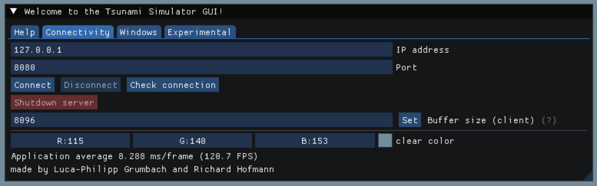

.. _usage:

Usage
======

Navigate to the local git repository. If the name wasnt explicitly changed, this should be the ``tsunami_lab`` folder.
If you have yet to set up and build the git repository locally, check out the :ref:`setup` page first.

Running with GUI
----------------------

.. note:: 
  By default, the compiled program includes a GUI. If you wish to turn this off, compile using the ``gui=no`` flag.

The program consists of two applications: the GUI (client) an the Simulator (Server). To start the GUI, run

.. code::
    
    ./build/gui

inside the ``tsunami_lab`` folder. To start the server, run

.. code::
    
    ./build/tsunami_lab <PORT>

also from inside the ``tsunami_lab`` folder. The ``<PORT>`` parameter specifies which port will be used for the remote connection.

The two applications may run on different machines, but you have to make sure that the server can be reached over TCP using
the machines ip address and the specified port.

Basic GUI Usage
-----------------

After starting a server, you can connect to it using the ``Connectivity`` tab of the main window:

Simply enter the server data and click ``Connect``.

.. warning::
  Since as of now the GUI is constantly being worked on, the usage guide will end here. We will complete it once the GUI has reached a stable phase.

Running without GUI
----------------------

Make sure you are inside the ``tsunami_lab`` folder.
To run the simulator, execute

.. code::
    
    ./build/tsunami_lab

from the command line. This will use the default run configuration which can be found in the ``config.json`` file.
You may choose a different run configuration by providing its file path relative to where you are
executing the command from. For example

.. code::
    
    ./build/tsunami_lab yourconfig.json

in case ``yourconfig.json`` is also located inside the ``tsunami_lab`` folder. If it were inside the ``resources`` folder,
you would need to specify the relative path like ``resources/yourconfig.json``

Configuration files
---------------------

Most of the optional parameters can be set inside a ``JSON`` configuration file.
As of now, these are:

.. list-table::
   :header-rows: 1

   * - keyword
     - description
     - type
     - value
   * - solver
     - which solver to use
     - string
     - "roe" or "fwave"
   * - nx
     - number of cells in x-direction
     - integer
     - >0
   * - ny
     - number of cells in y-direction
     - integer
     - >0
   * - nk
     - number of cells in x- and y-direction to be averaged into one in the output file
     - integer
     - >0
   * - simulationSizeX
     - simulation size in x-direction
     - float
     - metres, >0
   * - simulationSizeY
     - simulation size in y-direction
     - float
     - metres, >0
   * - hasBoundaryL
     - is there a boundary on the left?
     - boolean
     - true or false
   * - hasBoundaryR
     - is there a boundary on the right?
     - boolean
     - true or false
   * - hasBoundaryT
     - is there a boundary at the top?
     - boolean
     - true or false
   * - hasBoundaryB
     - is there a boundary at the bottom?
     - boolean
     - true or false
   * - endTime
     - how much time will be simulated
     - float
     - seconds
   * - stationFrequency
     - frequency at which stations will capture data
     - float
     - seconds
   * - offsetX
     - domain offset from 0 in x direction
     - float
     - metres
   * - offsetY
     - domain offset from 0 in y direction
     - float
     - metres
   * - checkpointFrequency
     - frequency of checkpoints in real time
     - float
     - seconds

as well as another two with more complicated parameters:

.. list-table::

   * - bathymetry
     - file path to a bathymetry csv File
     - string
     - see below
   * - setup
     - which setup to use
     - string
     - see below
   * - stations
     - info on stations
     - string array
     - see below

You may provide a **bathymetry** file path to read bathymetry data from a file.

In a bathymetry file, you need to specify the dimensions first. 
This is because for all other coordinates for which you dont specify any bathymetry data,
the bathymetry will be set to 0. A valid file may look like this:

.. code::

  #dimensions
  DIM,100,100
  #x,y,bathymetry
  37, 25, 30
  38, 25, 30
  39, 25, 30
  40, 25, 30

.. note::
  You may include comments by starting the line with a ``#``

.. warning::

  Loading bathymetry from a file means that ALL bathymetry data from 
  the selected setup will be overwritten.

**setup** takes the following parameters:

* "GENERALDISCONTINUITY1D"
* "DAMBREAK1D"
* "CIRCULARDAMBREAK2D"
* "RARERARE1D"
* "SHOCKSHOCK1D"
* "SUBCRITICAL1D"
* "SUPERCRITICAL1D"
* "TSUNAMIEVENT1D"
* "TSUNAMIEVENT2D"
* "ARTIFICIAL"

.. note:: 
    In order to use the one-dimensional setups **ny** and **simulationSizeY** has to be set to 1 in the config.json.

Specifying **stations** is done using the following syntax: 

.. code:: json

    "stations":[
        { "name":"station_1", "locX":0, "locY":3 },
        { "name":"station_2", "locX":1, "locY":2 },
        { "name":"station_3", "locX":2, "locY":1 },
        { "name":"station_4", "locX":3, "locY":0 }
      ]

.. note::
    Currently it is not supported to provide values for water height and momenta.
    However we are planning on implementing this in the future.

Testing
----------------

To execute the unit tests, simply run

.. code::

    ./build/tests

from the ``tsunami_lab`` directory.

To execute a sanity check using middle states, simply run

.. code::

    ./build/sanitychecks

from the ``tsunami_lab`` directory.
